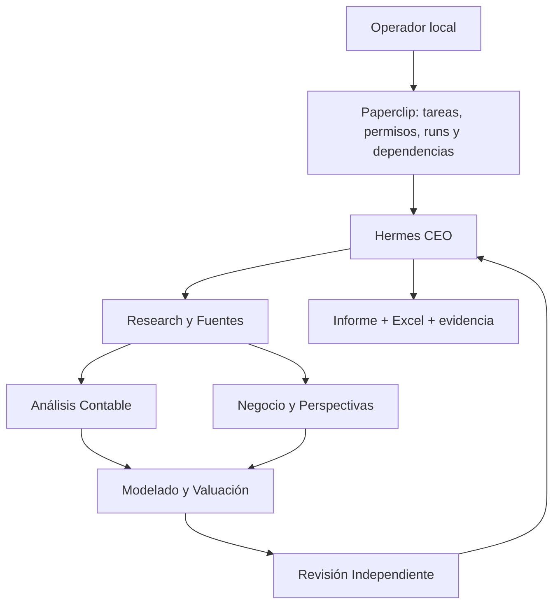

# Arquitectura

Ares es un paquete Python orientado a objetos: `OrganizationService` provisiona una sola compañía marcada; `PaperclipClient` encapsula autenticación y API; `AnalysisWorkflow` escribe tareas/dependencias; `Dossier` conserva fuentes y revisiones; `DcfModel`, `FinancialWorkbook` e `IndependentReviewer` separan cálculo, presentación y revisión. Validación de entradas mediante Pydantic; cálculo Decimal; errores explícitos y CLI sin secretos en logs.

Docker mantiene una red y dos volúmenes propios. El servidor usa modo authenticated, loopback del host y usuario no root después de inicializar raíces de volúmenes. El contenedor no monta Docker socket, escritorio de Windows ni carpetas del marketing existente. El servicio operator es efímero y tiene las credenciales del board; no se pasan a la configuración de agentes. El launcher elimina credenciales del operador y secretos de firma antes de ejecutar Hermes.

Los seis perfiles Hermes son distintos; el root `/data/hermes` permite el fallback oficial de credenciales sin distribuir auth.json. Los skill symlinks del adaptador existen dentro del Linux de Docker; las skills nativas y propias se copian a cada perfil con nombres separados de las skills de Paperclip. Reconciliación nativa de Paperclip sigue siendo del adaptador oficial, sin parchearlo.

Los agentes son colaboradores confiables dentro de una organización, no tenants adversarios: comparten UID y pueden usar terminal. Los controles de propietario de `Dossier.revise`, archivos read-only y hashes previenen errores a través de la API del paquete y detectan alteraciones; no impiden que un proceso con acceso al volumen intente escribir directamente. Para ejecutar código no confiable se requiere otro diseño de aislamiento, no afirmar que perfiles son sandboxes.

No se almacena una segunda cola. `state/organization.json` solo guarda IDs para reconciliar; Paperclip manda sobre estados/runs. Locks exclusivos evitan dos provisionadores locales, y los marcadores remotos permiten recuperar respuestas perdidas sin repetir POST ciegamente. Un lock residual se inspecciona; nunca se roba automáticamente.

Contexto en cuatro niveles: archivos de rol → skills → expediente inmutable/versionado → contexto de tarea. Los IDs de expediente incluyen toda la identidad y corte, evitando colisiones de ticker. Las sesiones del adaptador son por tarea, con un run por agente. Sin timers; CEO controla un máximo operativo de dos especialistas; ese máximo global es una política operativa, mientras el límite por agente se aplica en Paperclip.
